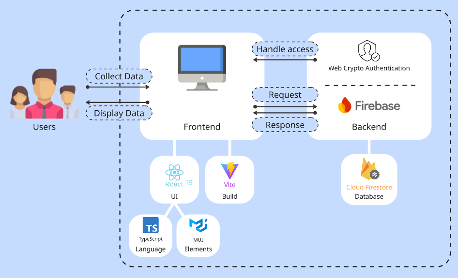
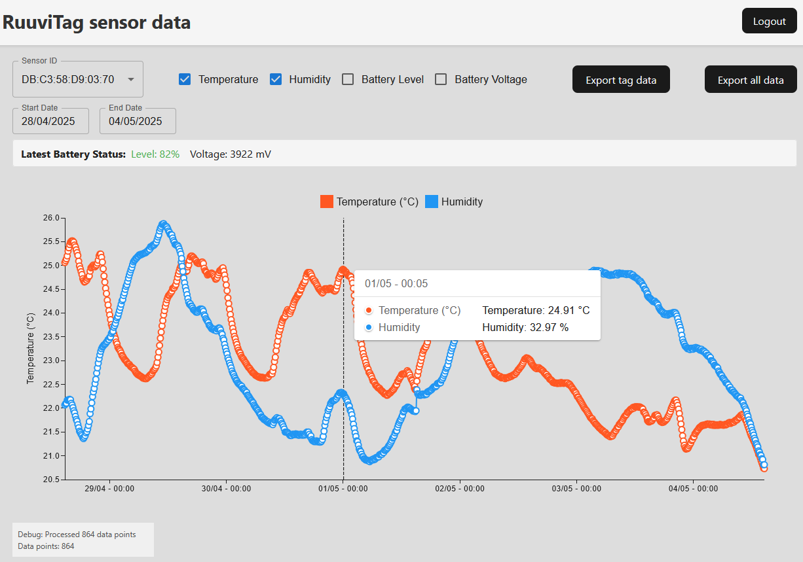
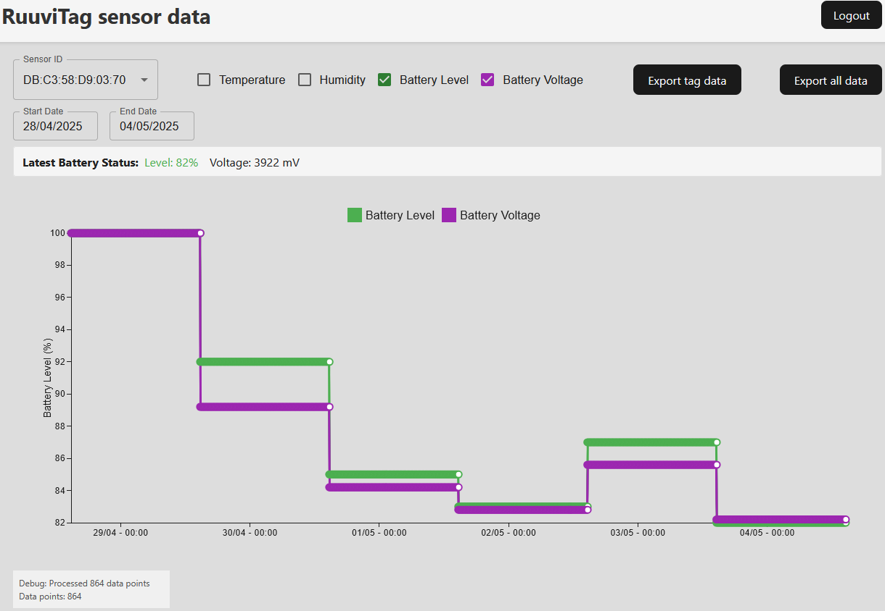
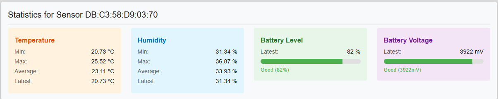

## Web app for IoT environmental monitoring project

A web app build with React, Vite and Firebase Firestore for IoT data management.

Acts as the GUI for environmental sensor data.

Data is fetched from Firebase Cloud Firestore.

## Overview
Web-based dashboard for visualizing environmental sensor data collected from RuuviTag sensors.

Features:
- Secure access with password authentication
- Interactive line charts for temperature and humidity data
- Statistical analysis of sensor readings
- Data export to CSV
- Support for multiple sensors/tags

Main dashboard view, with temperature and humidity selected

Dashboard view with battery status and voltage selected

Statistics panel

## Prerequisites
- Node (v22.14.0) download at https://nodejs.org/en
- npm (10.4.0)

## Getting started
### Clone the repository

`git clone https://github.com/edvni/IoT_web_app.git`
`cd IoT_web_app`

### Install dependencies
`npm install`

`npm install @mui/material @emotion/react @emotion/styled dayjs`

### Start the development server
`npm run dev`

The app will be available at `http://localhost:5173`

### Available scripts
- `npm run dev` - Start the development server
- `npm run build` - Build for production
- `npm run preview` - Preview the production build locally
- `npm run lint` - run ESLint

### Contributing
1. Pull the latest changes from the main branch
2. Create a new branch for your feature
3. Make your changes
4. Create a pull request
